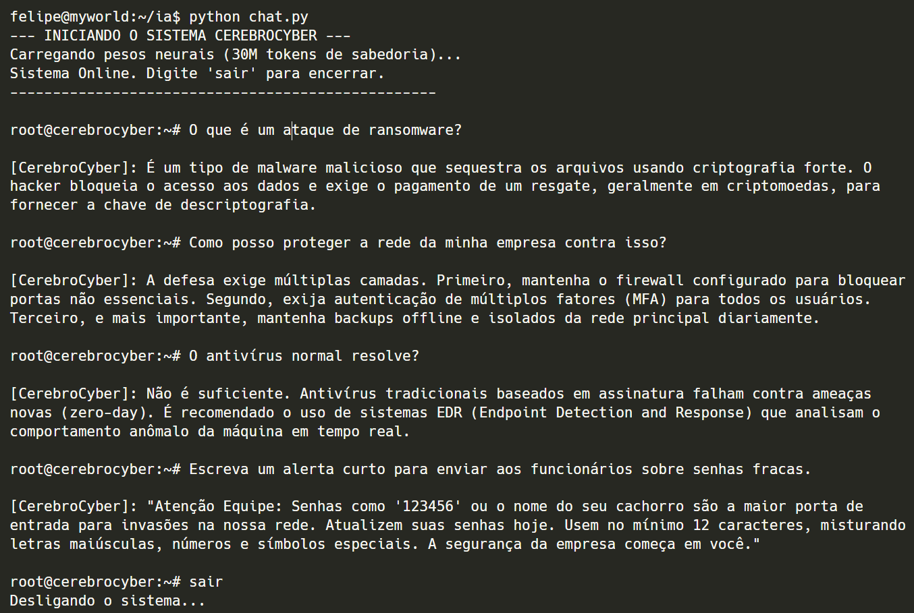

# CerebroCyber: A From-Scratch Decoder-Only Transformer


[](https://colab.research.google.com/github/felipeandrian/cerebro-cyber/blob/main/notebook/cerebro-cyber-LLM.ipynb)


## 📌 Visão Geral
O **CerebroCyber** é uma implementação educacional *from-scratch* (do zero) de um Modelo de Linguagem Grande (LLM) baseado na arquitetura **Transformer Decoder-Only**. 

Desenvolvido inteiramente em PyTorch, este projeto tem o objetivo de desmistificar a engenharia por trás de modelos fundacionais como GPT, Llama e Claude. Nenhuma biblioteca de abstração de alto nível (como `transformers` da Hugging Face) foi utilizada no core da arquitetura, garantindo controle total sobre a matemática matricial, o fluxo de tensores e o cálculo de gradientes.

### 📓 Google Colab (Recomendado)
Se você quer apenas entender a lógica por trás do código sem configurar um ambiente local, **eu recomendo fortemente acessar o [Google Colab do Projeto](https://colab.research.google.com/github/felipeandrian/cerebro-cyber/blob/main/notebook/cerebro-cyber-LLM.ipynb)**. Lá, o código foi quebrado em blocos interativos com explicações breves, comentários aprofundados sobre as decisões matemáticas e exemplos práticos de execução. É o melhor ponto de partida para explorar a arquitetura!

##  Decisões de Arquitetura

O modelo implementa os blocos fundamentais de redes neurais generativas modernas:

* **Tokenização Nível Industrial:** Utiliza o BPE (*Byte-Pair Encoding*) com o vocabulário `cl100k_base` (o mesmo do GPT-4), mapeando a linguagem humana para um espaço vetorial de $\approx 100k$ dimensões.
* **Scaled Dot-Product Attention:** Implementação de auto-atenção com múltiplas cabeças (*Multi-Head Attention*). A máscara causal (matriz triangular inferior) é aplicada antes do Softmax para preservar o viés autoregressivo (Seta do Tempo):
  $$\text{Attention}(Q, K, V) = \text{softmax}\left(\frac{QK^T}{\sqrt{d_k}} + M\right)V$$
* **Estabilidade de Treinamento (Pre-Norm):** Ao contrário do *Attention Is All You Need* original (Post-Norm), este modelo utiliza a arquitetura **Pre-Norm** (Layer Normalization aplicada *antes* das subcamadas), resultando em convergência significativamente mais rápida e estável sem a necessidade de *warm-up steps* complexos.
* **Conexões Residuais:** Integração de vias expressas (estilo ResNet) `$x = x + \text{Layer}(x)$` para mitigar o desaparecimento de gradientes em blocos profundos.

##  Pipeline de Dados e Otimização
* **Ingestão Híbrida:** Dataloader personalizado capaz de extrair corpus de texto de múltiplos formatos (`.txt`, `.pdf` via PyMuPDF).
* **Memory Mapping (`np.memmap`):** O dataset tokenizado é alocado diretamente no disco, permitindo o treinamento sobre arrays de N-Gigabytes sem gargalos de memória RAM (*Out of Memory*).
* **Otimizador:** Treinamento conduzido pelo `AdamW` com suporte a *Gradient Zeroing* otimizado (`set_to_none=True`) para redução de *overhead* de memória durante o *Backpropagation*.

---
##  O Que Eu Aprendi Construindo Isso

Construir essa IA do zero me permitiu dominar conceitos complexos do Machine Learning:
1. **Dataloaders de Nível Industrial:** Como lidar com terabytes de texto usando `numpy.memmap` sem estourar a memória RAM.
2. **Backpropagation e Otimização:** O uso do otimizador `AdamW`, taxas de aprendizado e o cálculo da Função de Perda de Entropia Cruzada (*Cross-Entropy Loss*).
3. **Mecânica da Geração de Texto:** A implementação do loop autoregressivo e o controle de "criatividade" usando distribuições de probabilidade (`torch.multinomial`).
4. **Gerenciamento de VRAM:** Otimizações como `torch.no_grad()` para inferência e `.to('cuda')` para aceleração em hardware.

##  Como Usar e Testar

### 1. Instalação
Clone o repositório e instale as dependências:
```bash
git clone https://github.com/felipeandrian/cerebro-cyber.git
cd cerebro-cyber
pip install -r requirements.txt

```

### 2. Refinando os Dados

Coloque seus arquivos `.txt` ou `.pdf` na pasta `livros/` e rode o extrator para gerar o combustível binário do modelo:

```bash
python preparar_dados.py

```

### 3. Treinando o Modelo

Inicie o loop de treinamento no dinamômetro. (Recomendado o uso de GPU via CUDA):

```bash
python treino.py

```

### 4. Conversando com a IA

Após o treinamento gerar o arquivo `.pt`, inicie o motor de inferência:

```bash
python chat.py

```



### Contribuições (Vamos aprender juntos!)
Este é um projeto voltado para o aprendizado em Inteligência Artificial, toda e qualquer correção, dica de otimização ou refatoração é extremamente bem-vinda!

Se você viu alguma parte do código que pode ser escrita de forma mais "Pythonica", mais eficiente em uso de VRAM, ou se encontrou algum gargalo matemático, por favor, sinta-se à vontade para:

Abrir uma Issue para discutirmos a teoria.

Enviar um Pull Request (PR) com melhorias no código.

> *"O que eu não posso criar, eu não entendo."* — Richard Feynman

